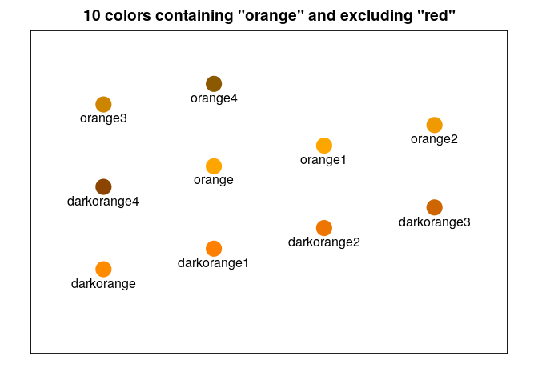

This is a small package for the class Data Exploration, DECS-922, at the
[Kellogg School of Management](https://www.kellogg.northwestern.edu/).
The packge currently contains templates to produce slides and homework
assignments; upon package installation these are automatically available
from RStudio’s `rmarkdown` templates list. It also contains the function
`colorkey`, which assists with finding an appropriate colorname as
defined by R.

For example, to find the appropriate version of red:

``` r
library(decs922)
colorkey('orange')
```


